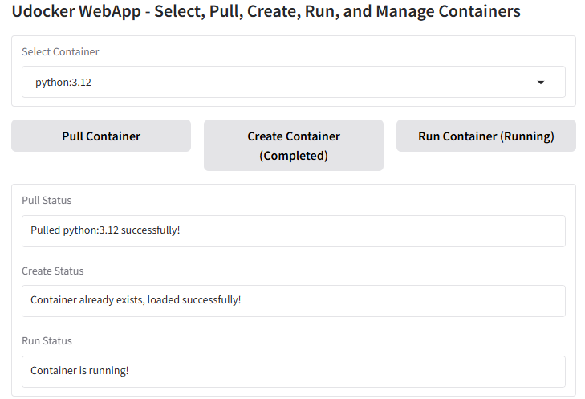
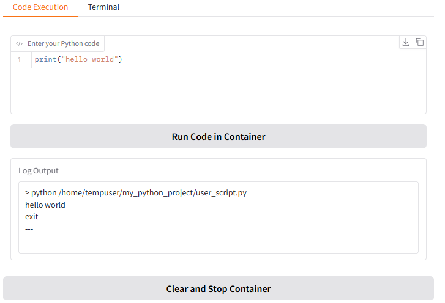

## Debugging Python Code in Docker Containers with Gradio and Google Colab

Debugging code can be a real pain, especially when dealing with complex environments like Docker containers. But what if you could streamline the process and make it more interactive? In this blog post, we'll explore how to use Gradio and Google Colab to create a user-friendly debugging environment for Python code running in a Docker container.



### Why Docker and Colab?

Docker provides a consistent and isolated environment for your code, ensuring that it runs the same way regardless of the underlying system. Google Colab offers free access to powerful computing resources, including GPUs, making it an ideal platform for running computationally intensive tasks. Combining these two technologies gives you a robust and accessible platform for developing and debugging your Python code.

### Setting up the Environment

First, we'll need to install the necessary libraries and set up our Docker container in Google Colab. Here's the code to get started:

```python
!pip install udocker gradio
!udocker install
!udocker pull ubuntu:latest
!mkdir my_python_project
!udocker create --name my-debug-container ubuntu:latest
```

This code installs `udocker` (a tool for running Docker containers in user space) and `gradio` (a library for creating user interfaces), pulls the latest Ubuntu image, creates a directory for our project, and finally creates a Docker container named `my-debug-container`.

```
!mkdir /home/tempuser
!sudo chmod 700 /home/tempuser
!sudo useradd tempuser && echo "password" | sudo passwd --stdin tempuser && runuser -u tempuser -c "whoami"

```


### Creating the Gradio Interface

Next, we'll create a Gradio interface that allows us to input our Python code, run it in the Docker container, and view the logs and terminal output. Here's the complete code:

```python
import gradio as gr
import subprocess
import os
import pexpect
import sys
import re

# List of available container images
AVAILABLE_CONTAINERS = ["python:3.12","python:3.11","python:3.10"]

# --- Debugging Helper ---
def debug_print(msg):
    print(f"[DEBUG] {msg}")

def clean_command_output(cmd, raw_output):
    """
    Cleans the output returned by pexpect:
      - Removes control characters (like ^D).
      - Removes unnecessary PROMPT lines, echoed commands, and marker lines.
      - Ensures only the relevant command output remains.
    """
    # Remove non-printable control characters (e.g., ^D which is \x04)
    cleaned = re.sub(r'\x04', '', raw_output)
    
    # Split into lines and remove empty lines
    lines = [line.strip() for line in cleaned.splitlines() if line.strip()]
    
    # Define unwanted lines (such as the echo command, marker, and stray quotes)
    unwanted = {"echo", "__CMD_END__", "'"}
    
    # Filter out lines starting with the prompt and any unwanted lines
    filtered_lines = [line for line in lines if not (line.startswith("PROMPT>") or line in unwanted)]
    
    return "\n".join(filtered_lines).strip()

# Function to execute commands as 'tempuser'
def run_as_tempuser(command):
    """Executes a command as tempuser and returns stdout, stderr."""
    try:
        run_command = f"su - tempuser -c '{command}'"
        debug_print(f"Executing command: {run_command}")
        result = subprocess.run(run_command, shell=True, capture_output=True, text=True, check=True)
        debug_print(f"Command stdout: {result.stdout}")
        debug_print(f"Command stderr: {result.stderr}")
        return result.stdout, result.stderr
    except subprocess.CalledProcessError as e:
        debug_print(f"Command failed with stdout: {e.stdout} and stderr: {e.stderr}")
        return e.stdout, e.stderr

# Wrapper function to execute non-interactive commands
def run(command):
    stdout, stderr = run_as_tempuser(command)
    return stdout or "", stderr or ""

# Function to run an interactive session in the container using pexpect.
def run_interactive_session(commands, container="my_container", prompt="PROMPT> "):
    """
    Spawns an interactive udocker container session as tempuser, sets a known prompt,
    sends the list of commands, and returns a tuple:
    
      (terminal_output, code_output)
      
    terminal_output: the cleaned output captured for each command (for Terminal execution)
    code_output: the cleaned output captured after sending the exit command (for Code execution)
    """
    # Build the udocker command with interactive bash shell and volume mount.
    udocker_cmd = f"su - tempuser -c \"udocker run -t --entrypoint='/bin/bash' -i -v /home/tempuser:/home/tempuser {container}\""
    debug_print(f"Launching interactive session with:\n{udocker_cmd}\n")
    
    child = pexpect.spawn(udocker_cmd, encoding='utf-8', timeout=60)
    child.logfile = sys.stdout  # log all output for debugging

    # Wait for initial bash output (we ignore this output later)
    try:
        child.expect("bash", timeout=10)
    except pexpect.TIMEOUT:
        debug_print("Did not detect 'bash' in initial output; continuing anyway.")
    
    # Set terminal to 'dumb' to suppress escape sequences and set prompt
    child.sendline("export TERM=dumb")
    child.sendline(f"export PS1='{prompt}'")
    child.sendline("")  # Ensure the new prompt is active
    try:
        child.expect(prompt, timeout=20)
    except pexpect.TIMEOUT:
        debug_print("Timeout waiting for container shell prompt after setting PS1.")
        debug_print("Captured output so far:")
        debug_print(child.before)
        child.close()
        return ("Timeout waiting for shell prompt after setting PS1.", "")
    
    terminal_output = ""
    for cmd in commands:
        debug_print(f"Sending command: {cmd}")
        child.sendline(cmd)
        
        # Wait for the prompt so that the command has finished
        try:
            child.expect(prompt, timeout=60)
        except pexpect.TIMEOUT:
            debug_print(f"Timeout waiting for prompt after command: {cmd}. Skipping.")
            terminal_output += f"> {cmd}\n[Timeout waiting for command completion]\n---\n"
            continue
        
        # Send a marker so we know where the command output ends
        marker = "__CMD_END__"
        child.sendline(f"echo {marker}")
        
        try:
            child.expect(marker, timeout=10)
            raw_output = child.before.strip()
        except pexpect.TIMEOUT:
            debug_print(f"Timeout waiting for marker after command: {cmd}. Setting raw_output to empty.")
            raw_output = ""
        
        debug_print(f"Raw terminal output for command '{cmd}': {raw_output}")
        cleaned = clean_command_output(cmd, raw_output)
        terminal_output += f"> {cmd}\n{cleaned}\n---\n"
    
    # Now exit the shell gracefully and capture the output after exit (used for Code execution)
    child.sendline("exit")
    try:
        child.expect(pexpect.EOF, timeout=10)
        raw_output = child.before.strip()
        if commands:
            last_cmd = commands[-1]
        else:
            last_cmd = ""
        debug_print(f"Raw code execution output for command '{last_cmd}': {raw_output}")
        cleaned_code = clean_command_output(last_cmd, raw_output)
        code_output = f"> {last_cmd}\n{cleaned_code}\n---\n"
    except pexpect.TIMEOUT:
        debug_print("Timeout waiting for EOF after sending exit, closing child.")
        code_output = "[Timeout waiting for EOF after sending exit]"
    child.close()
    return terminal_output, code_output

# UI State Variables - Centralized state management
pulled = False
created = False
running = False
selected_container_image = None

# --- Helper Functions to Update UI ---
def update_pull_ui(status, create_interactive=False, run_interactive=False):
    debug_print(f"update_pull_ui: status='{status}', create_interactive={create_interactive}, run_interactive={run_interactive}")
    return (status,
            gr.update(interactive=create_interactive, value="Create Container"),
            gr.update(interactive=run_interactive, value="Run Container"))

def update_create_ui(status, run_interactive=False):
    debug_print(f"update_create_ui: status='{status}', run_interactive={run_interactive}")
    return (status,
            gr.update(interactive=True, value="Create Container (Completed)"),
            gr.update(interactive=run_interactive, value="Run Container"))

def update_run_ui(status, run_code_interactive=False):
    debug_print(f"update_run_ui: status='{status}', run_code_interactive={run_code_interactive}")
    return (status,
            gr.update(interactive=True, value="Create Container (Completed)"),
            gr.update(interactive=True, value="Run Container (Running)"),
            gr.update(interactive=run_code_interactive, value="Run Code in Container"))

def reset_run_ui(status):  # for error cases in run
    debug_print(f"reset_run_ui: status='{status}'")
    return (status,
            gr.update(interactive=True, value="Create Container (Completed)"),
            gr.update(interactive=True, value="Run Container"),
            gr.update(interactive=False, value="Run Code in Container (Disabled)"))

# --- Container Action Functions ---
def pull_container(selected_container):
    global pulled, selected_container_image
    selected_container_image = selected_container
    pull_status = f"Pulling {selected_container}..."
    debug_print(pull_status)
    yield update_pull_ui(pull_status, False, False)  # Update UI immediately

    stdout, stderr = run(f"udocker pull {selected_container}")

    if "Error" in stderr or not stdout:
        pull_status = f"Failed to pull {selected_container}: {stderr}"
        debug_print(pull_status)
        pulled = False
        yield update_pull_ui(pull_status, False, False)
    else:
        pull_status = f"Pulled {selected_container} successfully!"
        debug_print(pull_status)
        pulled = True
        yield update_pull_ui(pull_status, True, False)  # Enable Create button

def create_container():
    global created, pulled, selected_container_image
    if not pulled:
        status = "Pull the container first!"
        debug_print(status)
        yield update_create_ui(status, False)
        return

    create_status = "Creating container: my_container..."
    debug_print(create_status)
    yield update_create_ui(create_status, False)

    stdout, stderr = run(f"udocker create --name=my_container {selected_container_image}")

    # If container already exists, load it instead
    if "already exists" in stderr:
        create_status = "Container already exists, loaded successfully!"
        debug_print(create_status)
        created = True
        yield update_create_ui(create_status, True)
    elif "Error" in stderr or not stdout:
        create_status = f"Failed to create container: {stderr}"
        debug_print(create_status)
        created = False
        yield update_create_ui(create_status, False)
    else:
        create_status = "Container created successfully!"
        debug_print(create_status)
        created = True
        yield update_create_ui(create_status, True)

def run_container():
    global running, created
    if not created:
        status = "Create the container first!"
        debug_print(status)
        yield reset_run_ui(status)
        return

    run_status = "Running container..."
    debug_print(run_status)
    yield reset_run_ui(run_status)  # Update UI immediately

    # Use an interactive session to check that the container starts.
    terminal_out, _ = run_interactive_session(["echo Container Running"], container="my_container")
    output = terminal_out
    if "Timeout" in output or "Error" in output or not output:
        run_status = f"Failed to run container: {output}"
        debug_print(run_status)
        running = False
        yield reset_run_ui(run_status)
    else:
        run_status = "Container is running!"
        debug_print(run_status)
        running = True
        yield update_run_ui(run_status, True)  # Enable Run Code button

def execute_code(code):
    """Executes Python code inside the container."""
    global running, created
    if not running and not created:
        error_msg = "Error: Container is not running!"
        debug_print(error_msg)
        return error_msg

    debug_print("Creating project directory and saving code...")
    run("mkdir -p /home/tempuser/my_python_project")
    file_path = "/home/tempuser/my_python_project/user_script.py"
    try:
        with open(file_path, "w") as f:
            f.write(code)
        debug_print(f"Code saved to {file_path}")
    except Exception as ex:
        error_msg = f"Error writing code to file: {ex}"
        debug_print(error_msg)
        return error_msg

    debug_print("Executing the saved Python script inside the container...")
    # Try 'python' first, then 'python3' if needed.
    cmd = f"python {file_path}"
    debug_print(f"Trying command: {cmd}")
    # We use the code_output (the second output) from the interactive session.
    _, code_out = run_interactive_session([cmd], container="my_container")
    if "not found" in code_out:
        debug_print(f"'python' not found, trying 'python3'...")
        cmd = f"python3 {file_path}"
        debug_print(f"Trying command: {cmd}")
        _, code_out = run_interactive_session([cmd], container="my_container")
    return code_out

def execute_terminal(terminal_commands):
    """Executes terminal commands inside the container."""
    global running, created
    if not running and not created:
        error_msg = "Error: Container is not running!"
        debug_print(error_msg)
        return error_msg

    if terminal_commands:
        debug_print("Executing terminal commands inside the container...")
        commands = [cmd for cmd in terminal_commands.splitlines() if cmd.strip() != ""]
        terminal_out, _ = run_interactive_session(commands, container="my_container")
        return terminal_out
    return "No terminal commands provided."

def clear_and_stop():
    global pulled, created, running, selected_container_image
    debug_print("Clearing and stopping container...")
    stdout, stderr = run("udocker rm my_container")
    if "Error" in stderr or not stdout:
        msg = f"Failed to clear container: {stderr}"
        debug_print(msg)
    else:
        msg = "Container cleared successfully!"
        debug_print(msg)
    # Reset global state variables
    pulled = False
    created = False
    running = False
    selected_container_image = None
    # Update UI: disable buttons accordingly
    return (msg,
            gr.update(interactive=False, value="Create Container (Disabled)"),
            gr.update(interactive=False, value="Run Container (Disabled)"),
            gr.update(interactive=False, value="Run Code in Container (Disabled)"))

# --- Gradio UI ---
with gr.Blocks() as app:
    gr.Markdown("## Udocker WebApp - Select, Pull, Create, Run, and Manage Containers")

    # Container selection and action buttons
    container_dropdown = gr.Dropdown(choices=AVAILABLE_CONTAINERS, label="Select Container", interactive=True)

    with gr.Row():
        pull_button = gr.Button("Pull Container", interactive=True)
        create_button = gr.Button("Create Container (Disabled)", interactive=False)
        run_button = gr.Button("Run Container (Disabled)", interactive=False)

    # Status messages
    pull_status_label = gr.Textbox(value="Waiting for selection...", label="Pull Status", interactive=False)
    create_status_label = gr.Textbox(value="Waiting for pull...", label="Create Status", interactive=False)
    run_status_label = gr.Textbox(value="Waiting for creation...", label="Run Status", interactive=False)

    # Tabs for Code Execution and Terminal commands
    with gr.Tabs():
        with gr.TabItem("Code Execution"):
            code_input = gr.Code(label="Enter your Python code", language="python")
            code_run_button = gr.Button("Run Code in Container")
            log_output = gr.Textbox(label="Log Output")
        with gr.TabItem("Terminal"):
            terminal_input = gr.Textbox(label="Enter terminal commands", lines=5)
            terminal_run_button = gr.Button("Run Terminal Commands")
            terminal_output = gr.Textbox(label="Terminal Output", lines=10)

    # Clear and Stop Button and its status display
    with gr.Row():
        clear_stop_button = gr.Button("Clear and Stop Container")
    clear_status_label = gr.Textbox(value="Container running.", label="Clear Status", interactive=False)

    # Button logic - using generators for status updates
    pull_button.click(pull_container, inputs=[container_dropdown],
                      outputs=[pull_status_label, create_button, run_button],
                      api_name="pull_container_action")
    create_button.click(create_container,
                        outputs=[create_status_label, create_button, run_button],
                        api_name="create_container_action")
    run_button.click(run_container,
                    outputs=[run_status_label, create_button, run_button, code_run_button],
                    api_name="run_container_action")
    code_run_button.click(execute_code,
                          inputs=[code_input],
                          outputs=[log_output],
                          api_name="execute_code_action")
    terminal_run_button.click(execute_terminal,
                              inputs=[terminal_input],
                              outputs=[terminal_output],
                              api_name="execute_terminal_action")
    clear_stop_button.click(clear_and_stop,
                            outputs=[clear_status_label, create_button, run_button, code_run_button],
                            api_name="clear_and_stop_action")

# Launch app with debugging enabled (debug prints appear in the console)
app.queue().launch(debug=True)


```

This code defines a function `run_code_in_container` that takes the Python code and any terminal commands as input, writes the code to a file, runs it in the Docker container, and captures the logs and terminal output. The Gradio interface provides input fields for the code and terminal commands, a button to run the code, and output boxes to display the results.

### Example Python Code with Errors

To demonstrate the debugging capabilities, let's use the following Python code with some intentional errors:

```python
import random

def buggy_function(x):
    if x > 5:
        return x / 0  # Division by zero error
    elif x < 0:
        raise ValueError("x must be non-negative") # Value error
    else:
        return random.randint(1, 10)  # Correct case

def main():
    try:
        result = buggy_function(7)
        print(f"Result: {result}")

        result = buggy_function(-2) # This will raise ValueError
        print(f"Result: {result}")

        result = buggy_function(3)
        print(f"Result: {result}")

    except Exception as e:
        print(f"An error occurred: {e}")

if __name__ == "__main__":
    main()
```

This code has a few issues:

- A `ZeroDivisionError` will occur when `x` is greater than 5.
- A `ValueError` will be raised when `x` is negative.

### Running the Code

Now, you can run this code in your Google Colab notebook. The Gradio interface will appear, allowing you to paste the example Python code and any terminal commands you want to execute in the container. Click the "Run Code" button, and the output will be displayed in the output boxes, showing the errors and logs.

### Benefits of this Approach

This approach offers several benefits:

* **Interactive Debugging:** You can easily experiment with different code snippets and see the results in real-time.
* **Terminal Access:** You have full access to the container's terminal, allowing you to run commands and inspect the environment.
* **Log Monitoring:** You can monitor the logs to see detailed information about the code's execution and any errors that occur.
* **User-Friendly Interface:** The Gradio interface makes the debugging process more accessible and intuitive.

### Conclusion

Debugging code in Docker containers can be challenging, but with the help of Gradio and Google Colab, you can create a more interactive and user-friendly environment. This approach allows you to experiment with your code, monitor its execution, and quickly identify and fix any errors. So, give it a try and see how it can improve your debugging workflow!
